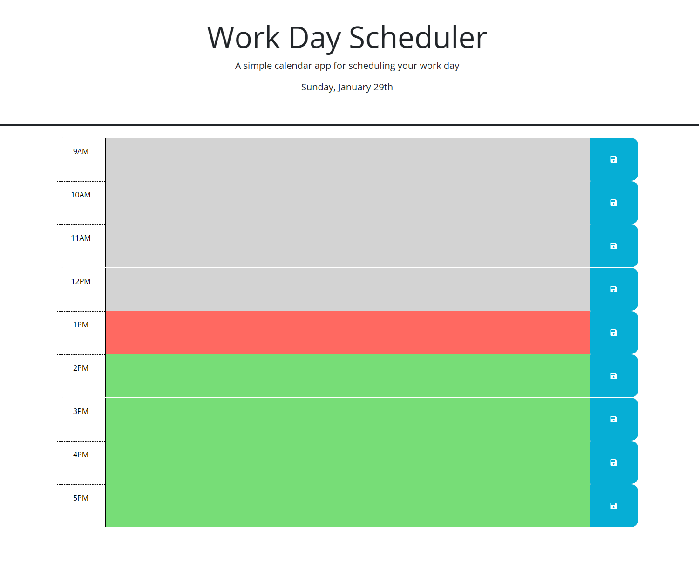

# pencil-me-in## Description

-A simple planner made to help organize tasks by the hour for a busy work day.
-Color changing hourly blocks help to visualize what important tasks have passed, are currently needing to be done, and need to be done in the future.
-Learned how to simplify code to get much longer code into an easier to read format for simple tasks.

## Installation

N/A

## Usage

https://github.com/d-lil/pencil-me-in

What the planner looks like when opened.

You can type tasks into the hourly blocks and save them, so if the page refreshes they are still there.

## Credits

Referenced this to try to figure out how to add a working changing suffix for the date, but simplified it to my liking:
https://stackoverflow.com/questions/13203518/javascript-date-suffix-formatting

## License

The MIT License (MIT)

Copyright (c) 2023 Daniel Liljegren

Permission is hereby granted, free of charge, to any person obtaining a copy of this software and associated documentation files (the "Software"), to deal in the Software without restriction, including without limitation the rights to use, copy, modify, merge, publish, distribute, sublicense, and/or sell copies of the Software, and to permit persons to whom the Software is furnished to do so, subject to the following conditions:

The above copyright notice and this permission notice shall be included in all copies or substantial portions of the Software.

THE SOFTWARE IS PROVIDED "AS IS", WITHOUT WARRANTY OF ANY KIND, EXPRESS OR IMPLIED, INCLUDING BUT NOT LIMITED TO THE WARRANTIES OF MERCHANTABILITY, FITNESS FOR A PARTICULAR PURPOSE AND NONINFRINGEMENT. IN NO EVENT SHALL THE AUTHORS OR COPYRIGHT HOLDERS BE LIABLE FOR ANY CLAIM, DAMAGES OR OTHER LIABILITY, WHETHER IN AN ACTION OF CONTRACT, TORT OR OTHERWISE, ARISING FROM, OUT OF OR IN CONNECTION WITH THE SOFTWARE OR THE USE OR OTHER DEALINGS IN THE SOFTWARE.